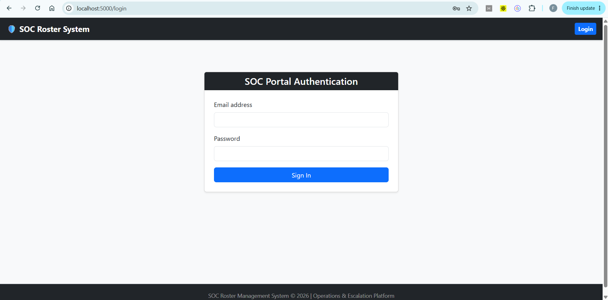
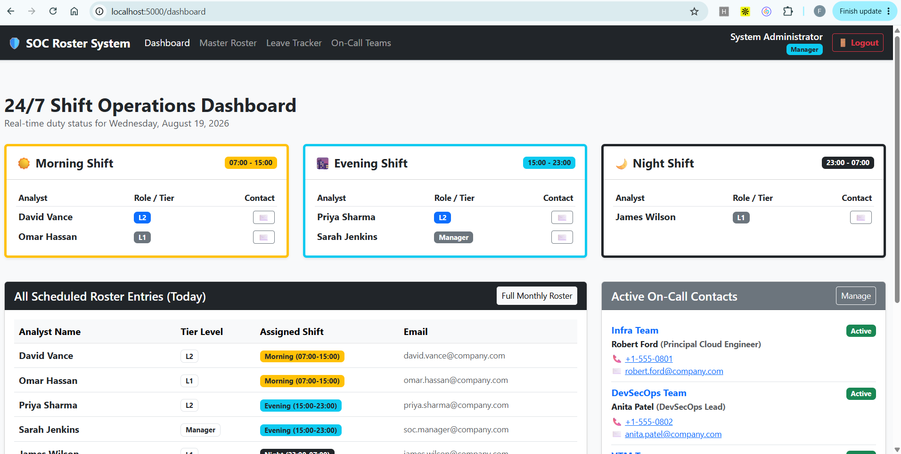
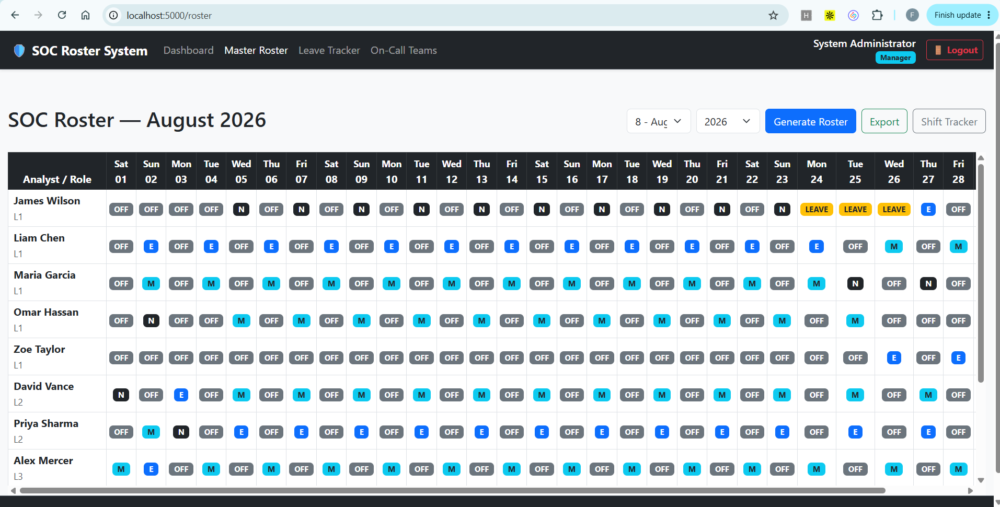
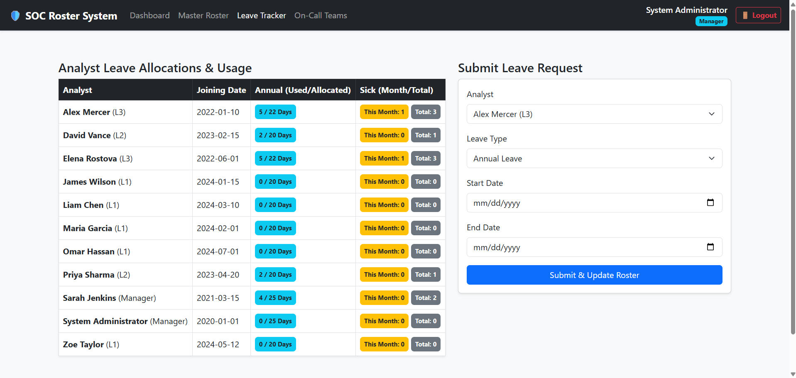
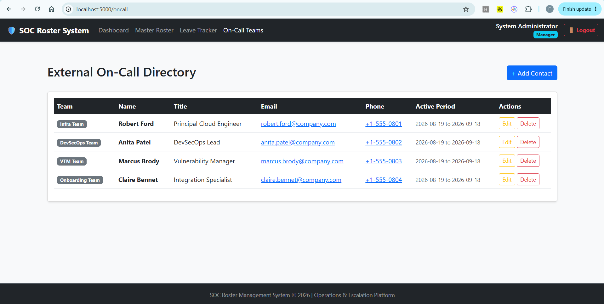
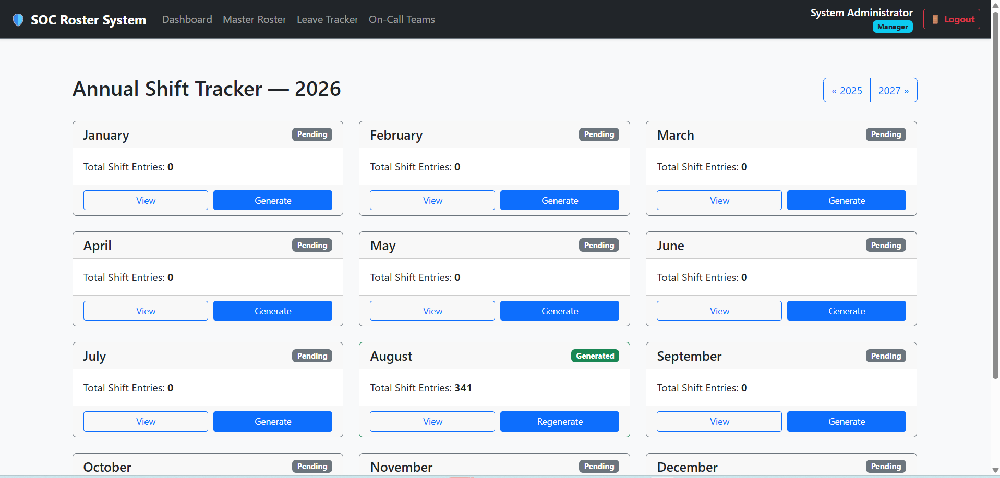

# 🛡️ SOC 24/7 Shift Roster & Operations Platform

<div align="center">


**Enterprise Workforce Scheduling & Operations Management Platform for Security Operations Centers (SOC)**

Automated Shift Scheduling • Leave Management • Analyst Hierarchy • Escalation Management • Real-Time Operations Dashboard

</div>

---

# 📋 Overview

SOC Roster System is an enterprise-grade Flask application built to manage continuous 24/7 Security Operations Center staffing and workforce planning.

The platform automates shift scheduling, analyst assignments, leave management, escalation contact tracking, and operational visibility while enforcing staffing rules and analyst fatigue protections.

Designed for modern SOC teams, MSSPs, MDR providers, NOCs, and enterprise cybersecurity operations.

---

# ✨ Key Features

### 🔄 Automated 24/7 Shift Scheduling

Generate continuous shift coverage with:

| Shift      | Schedule      |
| ---------- | ------------- |
| 🌅 Morning | 07:00 – 15:00 |
| 🌆 Evening | 15:00 – 23:00 |
| 🌙 Night   | 23:00 – 07:00 |

Capabilities:

* Monthly roster generation
* Continuous SOC coverage
* Automated analyst allocation
* Leave-aware scheduling
* Balanced workload distribution

---

### 🛡️ Analyst Hierarchy Enforcement

Support for multi-tier analyst structures:

* L1 Analyst
* L2 Analyst
* L3 Analyst
* SOC Manager
* SOC Lead

Scheduling policies ensure appropriate senior analyst coverage across operations.

---

### 😴 Fatigue Management Controls

Built-in protections to improve workforce sustainability:

* Prevents Night → Morning scheduling conflicts
* Avoids duplicate shift assignments
* Reduces analyst fatigue
* Supports fair rotation practices

---

### 🏖️ Leave Management

Comprehensive leave workflow including:

* Leave request submission
* Approval management
* Availability tracking
* Automatic roster recalculation
* Conflict prevention

---

### 📞 External On-Call Management

Maintain escalation contacts for:

* Infrastructure Teams
* Cloud Operations
* Network Operations
* DevSecOps Teams
* Vendor Support Teams

---

### 📊 Real-Time Operations Dashboard

Monitor:

* Active analysts
* Current shift coverage
* Daily roster assignments
* Escalation contacts
* Operational staffing status

---

# 📸 Application Screenshots

## 🔐 Authentication Portal

Secure login interface for SOC administrators and analysts.



---

## 📊 Operations Dashboard

Real-time visibility into active SOC operations and staffing coverage.

### Highlights

* Active Morning, Evening, and Night shifts
* Current analyst assignments
* On-call escalation contacts
* Daily roster visibility
* Operational status overview



---

## 📅 Master Roster Management

Monthly scheduling interface designed for workforce planning and shift allocation.

### Highlights

* Monthly roster generation
* Shift allocation management
* Leave-aware scheduling
* Analyst tier visibility
* Export functionality



---

## 🏖️ Leave Tracker

Centralized leave management system for analyst availability planning.

### Highlights

* Leave request management
* Approval workflows
* Analyst availability tracking
* Schedule conflict prevention
* Automated roster adjustments



---

## 📞 On-Call Teams Directory

Manage escalation contacts and external support teams.

### Highlights

* Escalation management
* Contact directory
* Active support windows
* Team ownership visibility
* Incident support readiness



---

## 🚨 Shift Tracker

Monitor active shifts and workforce utilization in real time.

### Highlights

* Active shift monitoring
* Coverage verification
* Analyst assignment tracking
* Operational visibility
* Workforce monitoring



---

# 🏗️ System Architecture

```text
Users
  │
  ▼
Flask Application
  │
  ├── Authentication
  ├── Dashboard Module
  ├── Roster Engine
  ├── Leave Management
  ├── Shift Tracker
  ├── On-Call Directory
  │
  ▼
PostgreSQL Database
  │
  ├── Users
  ├── Roles
  ├── Roster Entries
  ├── Leave Requests
  └── External Contacts
```

---

# 📂 Repository Structure

```text
soc-roster-app/
│
├── app/
│   │
│   ├── services/
│   │   └── roster_generator.py
│   │
│   ├── static/
│   │   ├── css/
│   │   │   └── style.css
│   │   └── js/
│   │       └── roster.js
│   │
│   ├── templates/
│   │   ├── base.html
│   │   ├── dashboard.html
│   │   ├── leave.html
│   │   ├── login.html
│   │   ├── oncall.html
│   │   ├── roster.html
│   │   ├── shift_tracker.html
│   │   └── users.html
│   │
│   ├── models.py
│   ├── routes.py
│   ├── scheduler.py
│   ├── utils.py
│   └── __init__.py
│
├── docs/
│   │
│   ├── images/
│   │   ├── login.png
│   │   ├── dashboard.png
│   │   ├── master-roster.png
│   │   ├── leave-tracker.png
│   │   ├── oncall-teams.png
│   │   └── shift-tracker.png
│   │
│   └── architecture/
│       └── system-architecture.png
│
├── config.py
├── docker-compose.yml
├── Dockerfile
├── requirements.txt
├── seed.py
├── run.py
├── .env.example
├── LICENSE
└── README.md
```

---

# ⚙️ Environment Configuration

Create a `.env` file in the project root.

```env
# Flask
FLASK_APP=run.py
FLASK_ENV=production
SECRET_KEY=your_super_secret_key

# PostgreSQL
POSTGRES_USER=soc_user
POSTGRES_PASSWORD=soc_pass
POSTGRES_DB=soc_roster_db

DATABASE_URL=postgresql://soc_user:soc_pass@db:5432/soc_roster_db
```

---

# 🐳 Docker Deployment

## 1. Clone Repository

```bash
git clone https://github.com/YOUR_USERNAME/soc-roster-app.git
cd soc-roster-app
```

## 2. Build Containers

```bash
docker-compose up --build -d
```

## 3. Seed Initial Data

```bash
docker-compose exec web python seed.py
```

## 4. Access Application

```text
http://localhost:5000
```

---

# 💻 Local Development Setup

## Create Virtual Environment

```bash
python -m venv venv
```

Windows

```bash
venv\Scripts\activate
```

Linux/macOS

```bash
source venv/bin/activate
```

## Install Dependencies

```bash
pip install -r requirements.txt
```

## Initialize Database

```bash
python seed.py
```

## Run Application

```bash
python run.py
```

---

# 📖 Application Workflow

### 1. Authentication

Access the platform using role-based authentication.

### 2. User Administration

Manage SOC analysts and assign roles:

* L1 Analyst
* L2 Analyst
* L3 Analyst
* Manager
* Administrator

### 3. Leave Management

Track analyst availability and manage leave requests.

### 4. Roster Generation

Generate monthly schedules while enforcing operational rules.

### 5. Shift Tracking

Monitor active shifts and assigned personnel.

### 6. Escalation Management

Maintain external support teams and on-call contacts.

### 7. Dashboard Monitoring

Track current staffing levels and operational readiness.

---

# 🔒 Scheduling Rules

The roster engine enforces:

✅ Continuous 24/7 coverage

✅ Leave-aware scheduling

✅ Analyst workload balancing

✅ Senior analyst supervision requirements

✅ No duplicate shift assignments

✅ Fatigue protection controls

✅ Night-to-Morning conflict prevention

✅ Operational coverage validation

---

# 🎯 Use Cases

* Security Operations Centers (SOC)
* Managed Security Service Providers (MSSP)
* Managed Detection & Response (MDR)
* Network Operations Centers (NOC)
* Incident Response Teams
* Enterprise Cybersecurity Teams
* Global Security Monitoring Centers

---

# 🛠️ Technology Stack

| Layer            | Technology                    |
| ---------------- | ----------------------------- |
| Backend          | Flask                         |
| Frontend         | HTML, CSS, JavaScript, Jinja2 |
| Database         | PostgreSQL                    |
| ORM              | SQLAlchemy                    |
| Authentication   | Flask-Login                   |
| Containerization | Docker                        |
| Deployment       | Docker Compose                |

---

# 🚀 Future Enhancements

* Multi-site SOC support
* Shift swap requests
* Calendar integrations
* Email notifications
* Microsoft Teams integration
* SLA monitoring
* REST API support
* Advanced reporting
* Workforce analytics

---

# 🤝 Contributing

Contributions are welcome.

```bash
git checkout -b feature/new-feature
git commit -m "Add new feature"
git push origin feature/new-feature
```

Create a Pull Request for review.

---

# 📄 License

This project is licensed under the MIT License.

---

# 👨‍💻 Author

Built for modern Security Operations Centers requiring reliable, scalable, and automated 24/7 workforce scheduling and operational management.
